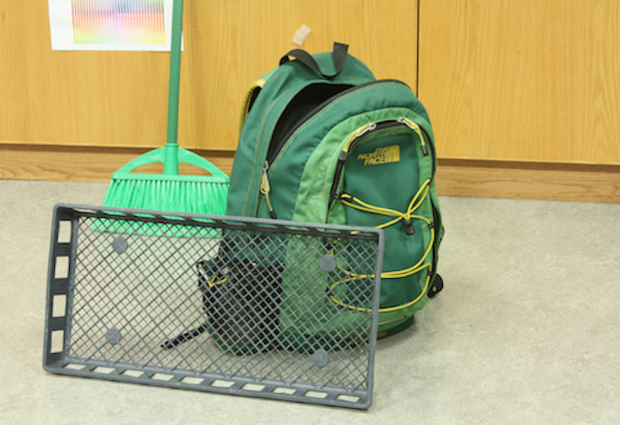
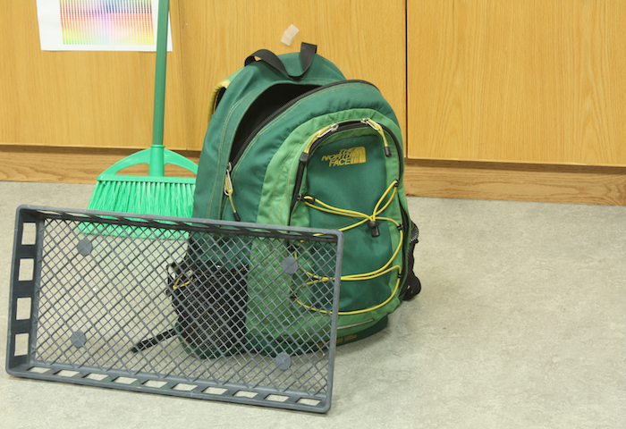
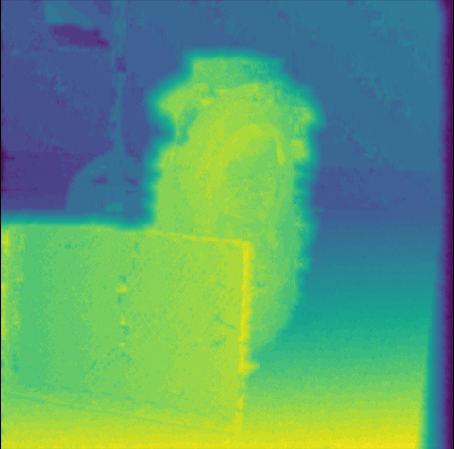

### CUDA Semi Global Block Matching
This repo contains a CUDA/C++ implementation of the [semi global block matching algorithm](http://openrs.whu.edu.cn/photogrammetry/2015/SGM%202008%20PAMI%20-%20Stereo%20Processing%20by%20Semiglobal%20Matching%20and%20Mutual%20Informtion.pdf)
Tested using AWS Ubuntu 18.04 Deep Learning machine image on a p2.xlarge instance (if you run on your own machine you will probably have to set the path to nvcc and CUDA lib in the Makefile). Also requires opencv. To Run:
```
make
./sgbm /path/to/left/img /path/to/right/img
``` 

The cuda kernels are defined in `lib/cuda_helper.cu`, there is one for each direction of aggregation (8 total) and 1 for an argmin over the result of aggregation (a 3-D array with dimensions (Disparity, Height, Width)). Census transforms, and then pixel-wise hamming distances between images are used as an alternative to mutual information which is what is used in original paper. These preprocessing steps are done on the CPU and defined in `lib/sgbm_helper.cpp`, the buffer is then transfered to GPU for aggregation and finally the argmin across the Disparity dimension.

The image in binary format will be written to `stereo_im.data`. The units of the image are raw disparity values because it has not been scaled by focal length and baseline distance. For sample data run `setup.sh` to download a pair of stereo images from Middlebury dataset.

If you are able to make it faster please submit a pull request!




